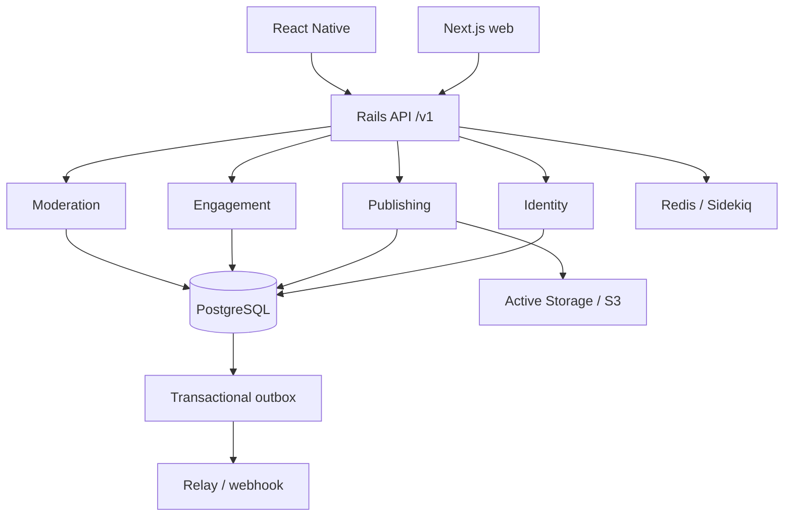
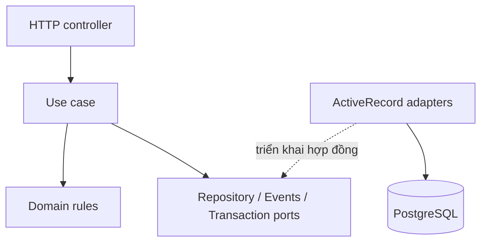

# Kiến trúc Xóm

## 1. Quyết định nền tảng

Bắt đầu bằng **modular monolith**, một Rails deployable với module nghiệp vụ rõ ràng. Web Next.js và React Native là hai client độc lập, cùng sử dụng REST `/api/v1`. Chưa cần tách mỗi bảng thành một microservice: ở giai đoạn đầu, điều đó thêm network failure, distributed transaction và vận hành nhiều dịch vụ trước khi biết ranh giới nào thực sự cần scale riêng.

Web được build bằng Next.js và phục vụ trên Sites. Cổng HTTP cùng origin chuyển `/api/v1/*` tới Rails trên Railway. PostgreSQL và Redis dùng mạng nội bộ Railway. Active Storage dùng persistent volume cho một instance API; S3 là adapter có sẵn cho bước scale tiếp theo.

## 2. Quyền sở hữu dữ liệu

| Module | Dữ liệu sở hữu | Trách nhiệm |
| --- | --- | --- |
| Identity | `identity_users`, `identity_sessions` | Mật khẩu, session, quyền, hồ sơ công khai |
| Publishing | `publishing_posts`, `publishing_topics`, attachment | Tạo/ẩn/xóa bài, feed, nội dung |
| Engagement | `engagement_votes`, `engagement_comments`, `engagement_bookmarks` | Tương tác của thành viên |
| Moderation | `moderation_reports` | Báo cáo, phân quyền và kết quả xử lý |
| Platform | `platform_outbox_events` | Adapter transaction và sự kiện |

Đây là các bảng có namespace trong **một database**, chưa phải database riêng cho mỗi dịch vụ. Foreign key xuyên module vẫn được giữ để bảo đảm toàn vẹn ở hiện tại. Khi tách dịch vụ, chúng cần được thay bằng kiểm tra qua public API và projection/sự kiện, không phải chỉ đổi hostname.

Mỗi module công bố `PublicApi`; repository không nhập model của module khác. `Publishing::PostPresenter` ghép các projection từ `Identity::PublicApi` và `Engagement::PublicApi`, đọc theo batch để tránh N+1. Controller là tầng tích hợp HTTP nên có thể điều phối nhiều module. Một ngoại lệ read-side có chủ đích: truy vấn saved feed dùng subquery trả về từ Engagement; cần thay bằng projection trước khi tách DB.

## 3. Clean Code và SOLID trong mã

| Nguyên lý | Áp dụng cụ thể |
| --- | --- |
| Single responsibility | Controller map HTTP; use case có một thao tác nghiệp vụ; repository quản lý lưu trữ; presenter map response |
| Open/closed | Thay HTTP/demo adapter qua `CommunityApi`; thay adapter sự kiện mà không sửa nghiệp vụ |
| Liskov substitution | Adapter có cùng signature và kiểu kết quả; bộ test HTTP và demo kiểm tra các hành vi quan trọng; demo được đánh dấu rõ, không giả lập đầy đủ production |
| Interface segregation | Use case chỉ nhận port nhỏ nó cần; `CreatePost` nhận repository/events/transaction; `CastVote` nhận repository/events |
| Dependency inversion | Constructor injection; use case phụ thuộc port được truyền vào; composition root lắp adapter Rails/ActiveRecord; adapter nằm bên ngoài |

Ruby dùng duck typing có kiểm thử; không tạo abstract base class/repository rỗng cho mỗi model. Các thao tác CRUD đơn giản giữ Rails idiom. Tách lớp khi có quy tắc hoặc phụ thuộc cần cô lập, tránh một service khổng lồ và tránh tạo lớp chỉ để chuyển tiếp một dòng.

Web và mobile chia theo tính năng. Mỗi form sở hữu input, validation và trạng thái gửi; screen điều phối, layout/card nhận props và không tự tạo HTTP client.

| Tầng | Web | Mobile | Phụ thuộc |
| --- | --- | --- | --- |
| Composition root | `providers/client-provider.tsx` | `src/providers/app-provider.tsx` | Chọn adapter và lắp `SessionStore` |
| Auth | `features/auth/auth-dialog.tsx` | `src/features/auth/auth-form.tsx` | `AuthApi`, store và validation dùng chung |
| Feed | `features/community` | `src/features/community` | `FeedApi`, query state, component trình bày |
| Đăng bài | `features/publishing` | `src/features/publishing` | `PublishingApi` |
| Tương tác | `features/engagement` | `src/features/engagement` | Các phương thức nhỏ của `EngagementApi` |
| Layout/UI | `components/layout`, `components/modal.tsx` | `src/ui` | Props và callbacks |

`SessionStore` độc lập với React, cookie và SecureStore. Revision của phiên vô hiệu hóa feed và dialog thuộc người dùng trước. Kết quả request cũ không được ghi đè phiên mới; đăng nhập/đăng xuất không chạy đồng thời. Khi logout thất bại mạng, UI giữ trạng thái đăng nhập để người dùng thử lại. HTTP 401 xóa credential native; lỗi 5xx không bị coi là logout.

Rails Identity có `RegisterAccount` và `SignIn`, nhận user repository, session repository, password verifier và transaction. `Identity::Commands` là composition root. Controller chỉ đọc tham số, gọi use case và trả cookie/JSON qua `SessionResponse`. Tạo user và phiên là một transaction; đăng nhập lại xoay phiên hiện tại, không đăng xuất các thiết bị khác.

## 4. Tính đúng khi nhiều người thao tác

**Bình chọn:** request `PUT /posts/:id/vote` mang giá trị tuyệt đối `-1/0/1`, không phải lệnh toggle. Unique index `(user_id, post_id)` ngăn bản ghi trùng; constraint chỉ chấp nhận `-1/1` trong bảng. Giá trị 0 xóa vote. Lock hàng bài viết và kiểm tra lại trạng thái sau khi lấy lock. Score tăng `new_value - previous_value`, cùng transaction với vote và outbox. Retry cùng giá trị không tăng điểm lần nữa. Đổi +1 sang -1 làm score giảm 2.

**Bình luận:** tạo comment và tăng counter trong cùng transaction với lock bài. Tạo post/comment hiện chưa có idempotency key từ client; retry POST sau timeout có thể tạo trùng. Cần bổ sung idempotency records trước client tự động retry POST.

**Outbox:** tạo bản ghi event trong cùng DB transaction với thay đổi nghiệp vụ. Relay dùng `FOR UPDATE SKIP LOCKED`, webhook HTTPS/HMAC, chỉ đánh dấu sau HTTP 2xx. Có thể giao trùng nếu receiver xử lý thành công nhưng relay chết trước khi đánh dấu. Receiver bắt buộc deduplicate theo UUID event; đây là **at-least-once**, không hứa exactly-once. Relay được chạy rõ ràng bằng profile `events`, không tự gửi dữ liệu khi chưa cấu hình endpoint. Chưa có broker, consumer production, dead-letter UI hay scheduler bên ngoài.

**Giới hạn:** lock từng post có thể trở thành điểm nghẽn cho một bài viral; đây là lựa chọn ưu tiên tính đúng ở MVP. Khi đo được contention, chuyển vote thành nguồn dữ liệu gốc, tính score bằng consumer idempotent và chấp nhận eventual consistency, thay vì bỏ lock mà vẫn hứa counter luôn đúng.

## 5. Feed và lưu trữ

- PostgreSQL: index cho trạng thái + thời gian, trạng thái + điểm, chủ đề và tìm kiếm title bằng trigram. Hot dùng log(score) + thời gian tạo để cân bằng độ mới và tương tác; đây là công thức khởi đầu cần thử nghiệm.
- Feed dùng signed cursor, page size 20, thứ tự rank + UUID để xử lý tie. Cursor ràng buộc bộ lọc và thời điểm bắt đầu, hết hạn sau một giờ. Tránh OFFSET sâu.
- Với hot/top, điểm đổi giữa các trang có thể làm bài chuyển thứ tự; cursor không phải snapshot bất biến của toàn bộ ranking. Client deduplicate IDs; feed lớn cần snapshot/materialized ranking hoặc Redis sorted set có version.
- Có preload topic, attachment và batch author/viewer state. Search body/tags và sort hot vẫn có thể scan rộng; cần EXPLAIN/ANALYZE, đo index và cache trước khi tuyên bố hỗ trợ tải lớn.
- Local Disk chỉ phù hợp dev hoặc một instance có persistent volume. Khi scale nhiều Rails instances, bật S3/R2 chung, CDN, upload direct có authorization và pipeline resize/re-encode. Hiện web upload qua Rails; video chưa được xử lý.
- Không lưu file media vào PostgreSQL. Không dùng filesystem container làm kho media production. Redis dev giữ queue; production cache/rate limit dùng Redis để nhất quán giữa instances.

## 6. Auth, quyền và dữ liệu người dùng

Đăng ký kiểm tra tên, email chuẩn hóa, mật khẩu tối thiểu 12 ký tự, tối đa 72 UTF-8 bytes và nhập lại mật khẩu. BCrypt lưu hash; đăng nhập email không tồn tại vẫn chạy kiểm tra digest giả. Session token ngẫu nhiên 48 bytes; DB chỉ lưu SHA-256 digest; thời hạn 30 ngày; logout thu hồi bản ghi. Web dùng cookie HttpOnly/Secure ở production, SameSite=Lax. Browser write kiểm tra Origin trong allowlist, bao gồm cả login. Native dùng Bearer token trong SecureStore, header xác định client và không dùng cookie; Origin lạ vẫn bị từ chối dù có header native.

Production đặt web và API trong cùng site, ví dụ `xom.vn` và `api.xom.vn`, hoặc dùng reverse proxy `/api`. Cookie Lax không hỗ trợ tùy ý hai domain khác site; nếu cần điều đó phải thiết kế BFF hoặc chính sách cookie/CSRF riêng. Không lưu access token web trong localStorage.

Role không được mass-assign từ đăng ký; chỉ moderator/admin được xử lý báo cáo. User chỉ xóa bài của mình. Feed và tương tác kiểm tra bài published. Image uploads kiểm tra MIME và kích thước. CORS allowlist, rate limits, parameter filtering, TLS/host validation cấu hình sẵn nhưng cần xác minh với ingress thật. Active Storage URLs có thể còn dùng được sau khi ẩn bài: trước public launch cần quy trình purge/revoke media, không coi ẩn DB là xóa khỏi CDN.

## 7. Lộ trình scale và tách dịch vụ

| Giai đoạn | Hành động | Tín hiệu để chuyển giai đoạn |
| --- | --- | --- |
| MVP | Rails + PostgreSQL + Redis; web/mobile độc lập | Xác nhận nhu cầu sản phẩm và test end-to-end |
| Tăng tải | Nhiều Rails instances sau load balancer, S3/CDN, worker riêng, tối ưu query/caching | P95, CPU, DB waits hoặc queue age vượt SLO đã thống nhất |
| Tách tác vụ nặng | Media processing trước; notification khi tính năng được triển khai | Worker tiêu tốn tài nguyên khác API hoặc có SLA riêng |
| Tách đọc | Search/feed projections riêng, event consumer idempotent | Truy vấn đọc/ranking chiếm phần lớn DB load |
| Tách domain | Engagement/Publishing theo ownership nhóm và tải thực tế | Cần deploy độc lập và boundary/event contract đã ổn định |

Khi tách một module: định nghĩa event contract versioned → thêm consumer/projection và replay → backfill dữ liệu → đối chiếu shadow reads → đổi một adapter sang network API → canary traffic → bỏ foreign key và read-side subquery xuyên DB. Trong mỗi bước giữ source of truth duy nhất, kế hoạch rollback và observability. Không dual-write độc lập vào DB và broker.

Chưa có load test nên không gán số người dùng hay RPS được hỗ trợ. Các chỉ số cần đo: API P50/P95/P99, lỗi 5xx, query chậm, pool wait, lock wait, Redis memory, queue age, tuổi event outbox chưa gửi, tỷ lệ upload lỗi và chi phí lưu trữ. Có request ID/logging nền tảng; dashboard metrics/tracing và cảnh báo production chưa được dựng.

## 8. Quyết định được ghi nhận

- ADR-001: Modular monolith trước, tách dịch vụ theo đo đạc và ownership.
- ADR-002: REST versioned + shared TypeScript contracts; không chia sẻ Rails model với client.
- ADR-003: Browser session bằng cookie; native session bằng SecureStore.
- ADR-004: Post, vote và outbox dùng transaction cục bộ; event giao ít nhất một lần.
- ADR-005: Next.js static + gateway trên Sites; Rails trên Railway. Gateway chỉ chuyển tiếp HTTP và cookie `xom_session`, không gửi cookie/identity của Sites sang Rails. Mobile dùng Rails trực tiếp. Local demo là adapter được chọn rõ ràng tại composition root.

Tài liệu tham khảo: [Rails API](https://guides.rubyonrails.org/api_app.html), [Rails locking](https://api.rubyonrails.org/classes/ActiveRecord/Locking/Pessimistic.html), [Next.js documentation](https://nextjs.org/docs), [Expo SecureStore](https://docs.expo.dev/versions/latest/sdk/securestore/). Quyết định kiến trúc trong tài liệu là thiết kế của dự án, không phải bảo đảm hiệu năng từ các nguồn tham khảo.
